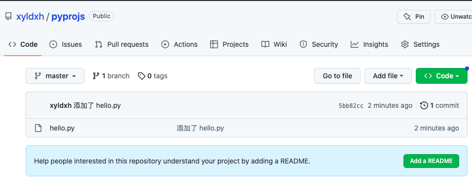

这里开一个小号，帮助小白快速学习一些git基本操作
## 1. 创建仓库
**step 1**

**step 2**

**step 3**

## 2. 配置ssh key
### 2.1 本地生存密钥
在命令行输入如下ssh命令，然后一直回车，结果如下就代表ok
```shell
ssh-keygen -t rsa -C "780222719@qq.com" 
# 这里的邮箱用你创建GitHub账号时用到的邮箱
```

### 2.2 将公钥上传到github


最终来到了这个页面

添加ssh key之前，需要前往终端，复制生成好的ssh key
在终端输入如下的命令：
```shell
cat ~/.ssh/id_rsa.pub
```
得到如下的结果，复制得到的公钥，填写到页面的ssh key：


### 2.3 测试连通性
在终端输入如下命令：
```shell
ssh -T git@github.com
```
出现下面的结果就是成功了

## 3. push到自己的仓库
### 3.1 克隆到本地
回到项目地址，然后复制ssh链接，

使用如下的命令，将刚刚创建的仓库克隆到本地目录
```shell
git clone git@github.com:xyldxh/pyprojs.git
```
### 3.2 添加自己的代码并push到仓库

### 3.3 使用git命令完成push前的操作
输入下面的命令：
```shell
# 需要配置一下，后面就不需要了，但如果你换设备，就需要重新从上传公钥那里开始配置了
git config --global user.name "xyldxh"
git config --global user.email "780222719@qq.com"
cd pyprojs
# ./*表示当前文件的全部内容，当然你也可以只添加部分内容
# 比如 git add ./hello.py
git add ./*
# 字符串内填写本次做了什么事
git commit -m "添加了hello.py"
git push
```


经过这些步骤后，可以回到自己的仓库，看看有什么变化

## 4. push到别人的仓库
我会fork我另一个账号的git仓库来演示这些操作
### 4.1 fork别人的仓库
来到别人的仓库，单击fork


### 4.2 克隆到本地
```shell
git clone git@github.com:xyldxh/simple-java-projs.git
```
### 4.3 添加自己的代码

### 4.4 push到自己的仓库
重复之前push操作（不需要重复git config）
```shell
git add ./greet
git commit -m "你好，很高兴能加入你的项目"
git push
```

### 4.5 申请pull request


注意：这张图片中的“hi”是你需要填写的内容，主要是说明你发现了什么问题希望合并，或者有什么新的功能等

## 5. git速成教程结束